## commmand name: git config --global user.name
**syntax:**
git config --global user.name "username"
## purpose:sets the global username for git commits on your system.
**screenshot:**

## command name: git config
 **syntax**
 git config --global user.email "email"
 ## purpose: sets the global email address associated with your git commmits
 **proof**
 

## commmand name: git config --list
**syntax:**
git config --list
## purpose:displays all git configuration settingd(system,global and local)
**screenshot:**
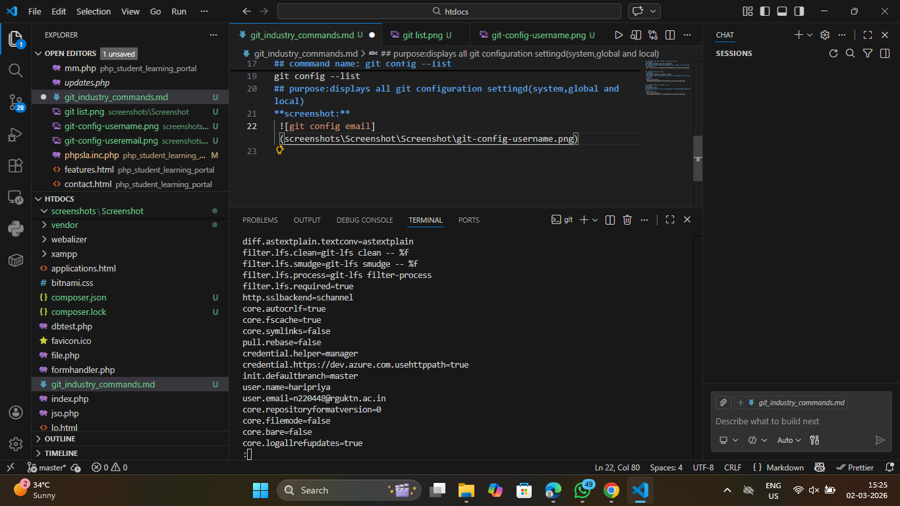

## commmand name: git config --unset
**syntax:**
git config --global --unset user.name
## purpose:removes a specific git configuration value
**screenshot:**
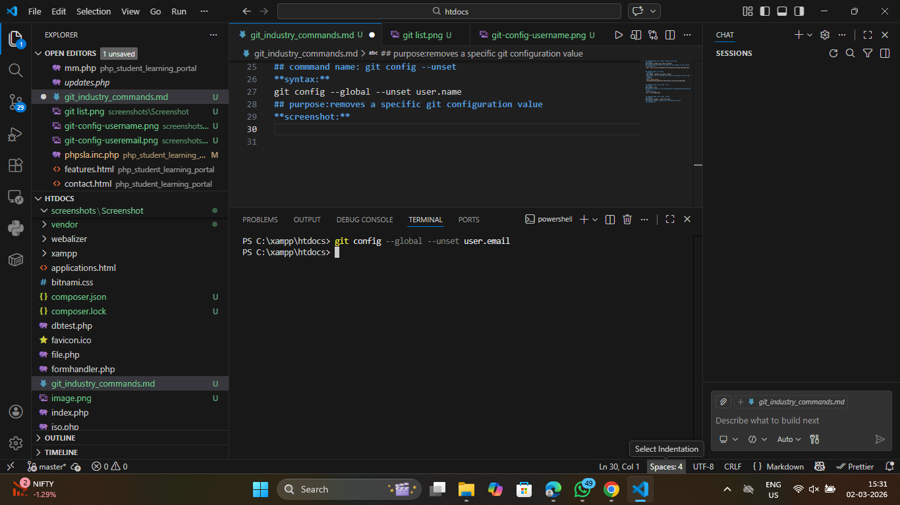

## commmand name: git init
**syntax:**
git init
## purpose:initializes a new repo in the current directory
**screenshot:**
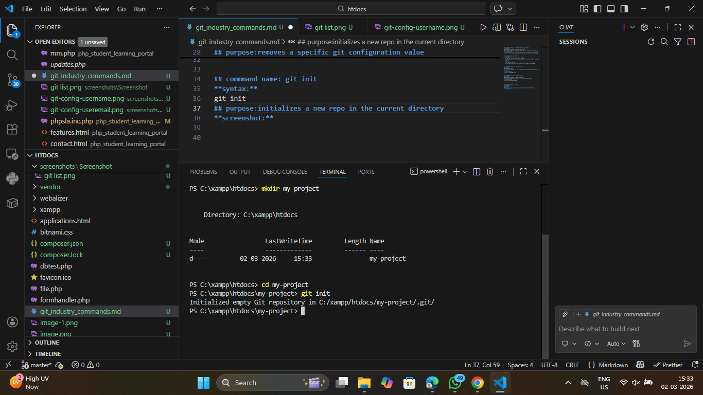

## commmand name: git clone
**syntax:**
git clone <repository-url>
## purpose:icreates a copy of a remote repository on your local machine
**screenshot:**
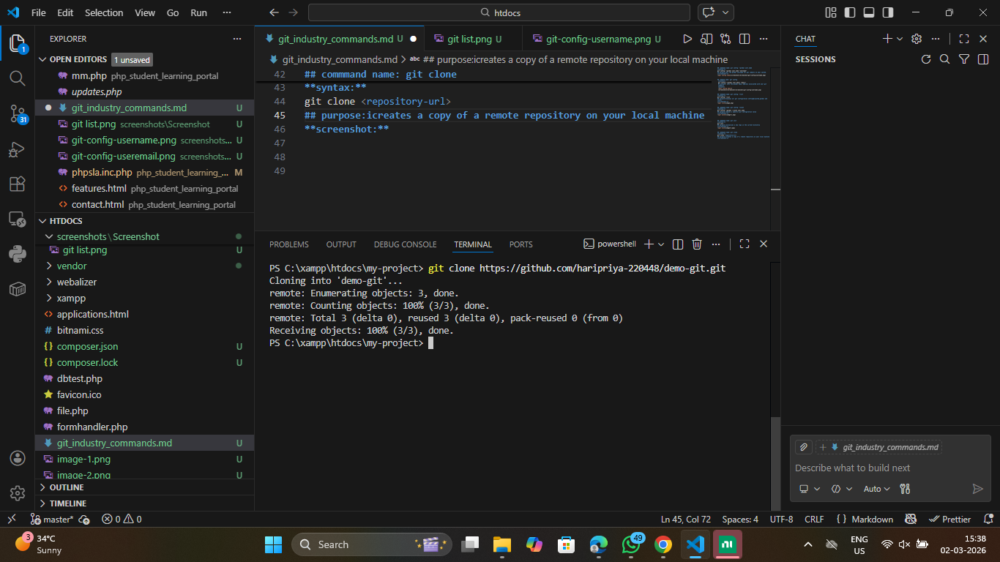

## commmand name: git clone --branch
**syntax:**
git clone --branch <branch name> <repo url>
## purpose:perfomes a shallow clone with limited commit history.
**screenshot:**
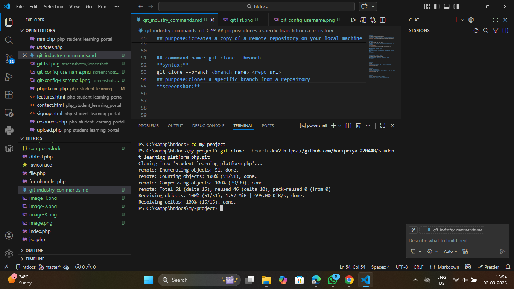

## commmand name: git clone --depth
**syntax:**
git clone --depth <number> <repo url>
## purpose:clones a specific branch from a repository
**screenshot:**
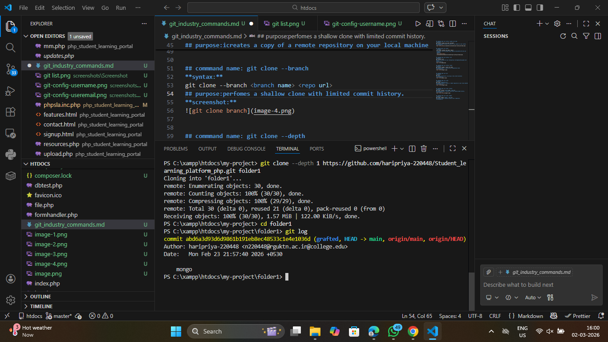

## commmand name: git status
**syntax:**
git status
## purpose:displays the state of the working directory and staging area
**screenshot:**
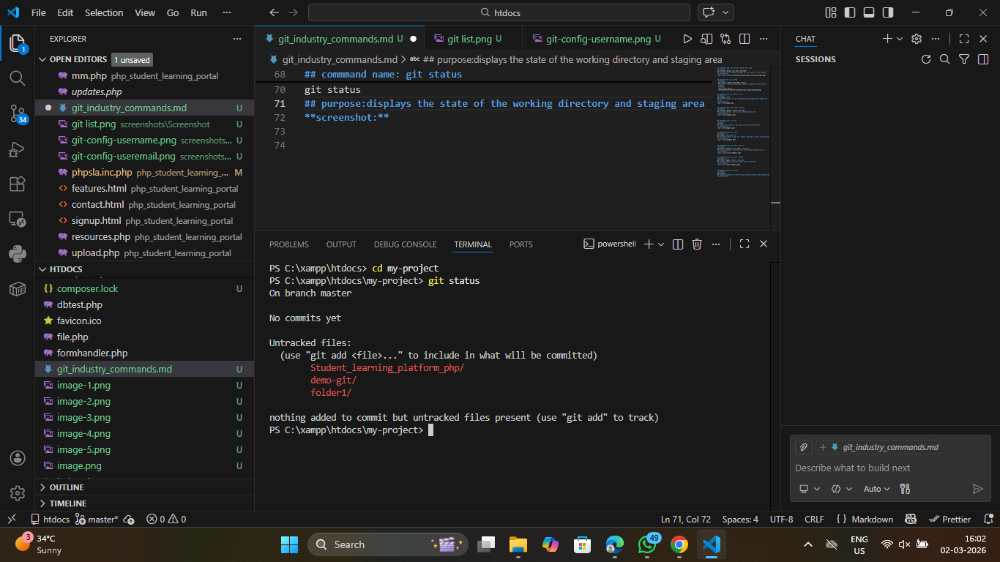

## commmand name: git log
**syntax:**
git log
## purpose:shows the commit history with the detailed information
**screenshot:**
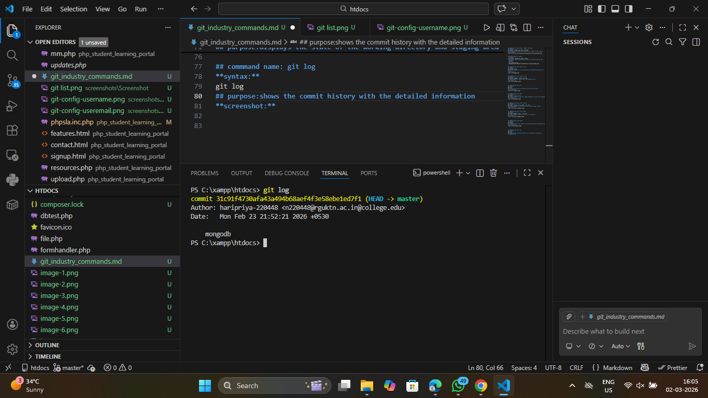

## commmand name: git log --oneline
**syntax:**
git log --oneline
## purpose:display commit history in a compact,singl-line format
**screenshot:**
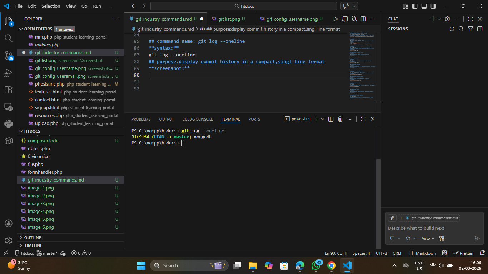

## commmand name: git log --graph
**syntax:**
git log --graph --oneline --all
## purpose:shows commit history in a grphical (branch structure) format
**screenshot:**
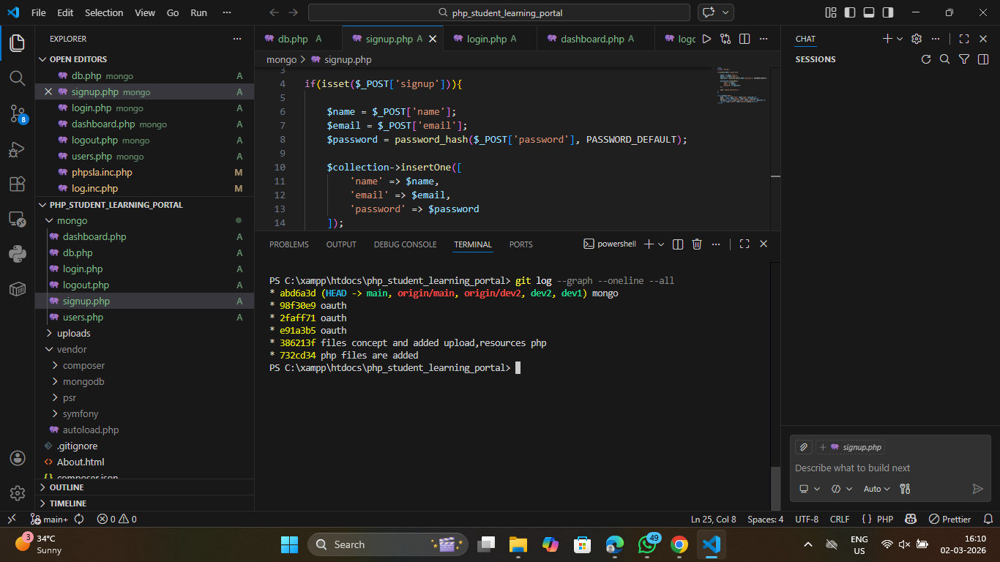

## commmand name: git show
**syntax:**
git show <commit -id>
## purpose:displays detailed information about a specific commit
**screenshot:**
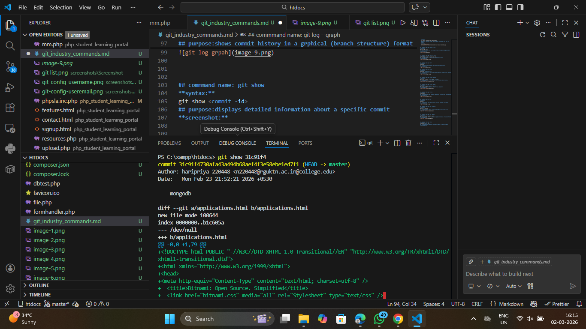

## commmand name: git diff
**syntax:**
git diff
## purpose:shows changes between working directory and staging area
**screenshot:**
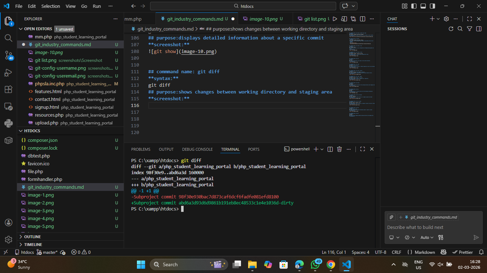

## commmand name: git diff --staged
**syntax:**
git diff --staged
## purpose:shows the difference between staged area and last commit
**screenshot:**
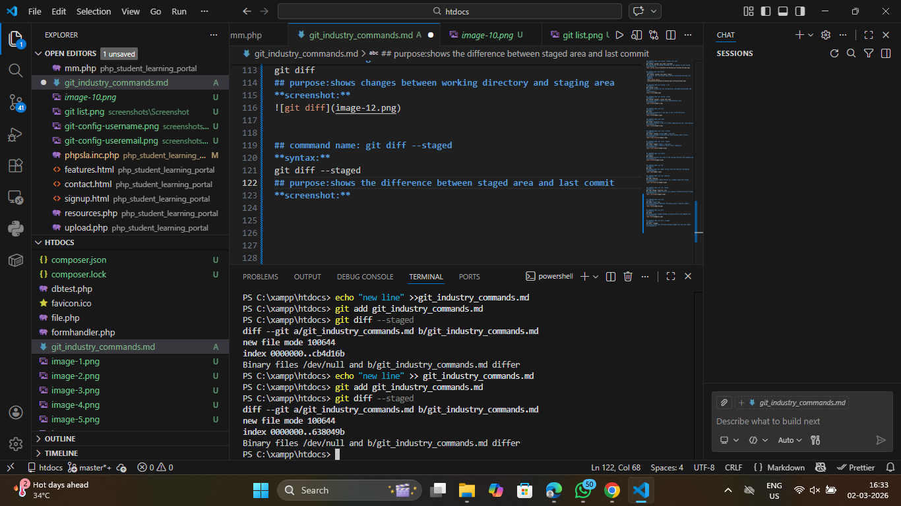

